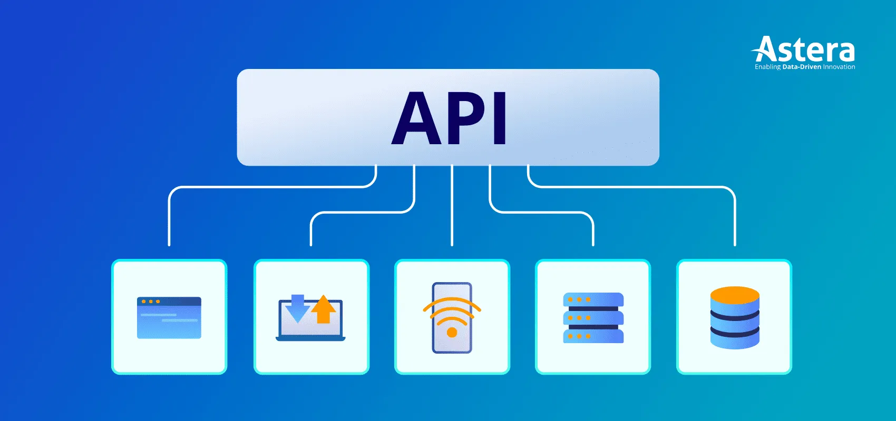

# API

 

# 🗝️ Sentido Semântico
- API é a sigla em inglês para ***Application Programming Interface***
- Em português significa ***Interface de Programação de Aplicações***

 

> **Programação de Aplicativo**
> - Criar soluções que atendam a problemas de negócio ou demandas específicas de sistemas!
>
> **Interface**
> - Interface = Contexto
>
> **API**
> - Uma aplicação desenvolvida para um negócio ou propósito específico, utilizando padrões e contratos de programação.
>
> **Resumo**
> - API é uma interface projetada para servir dados ou funcionalidades de maneira padronizada, utilizando protocolos de comunicação como:
>   - HTTP
>   - HTTP/3 (QUIC)
>   - HTTPS
>   - WEBSOCKET
>   - TCP
>   - UDP
>   - SMTP
>   - FTP
> 
> .

 

# 💡 O Que é?
> ## Uma API é uma aplicação backend projetada para servir dados e serviços de maneira padronizada.
> 
> **Para que Serve**
> - Receber e processar requisições, responder com dados ou ações para outras aplicações (seja um frontend ou outro backend).
> 
> **Como funciona?**
> - É uma aplicação programada utilzando algum padrão de protocolo para servir dados.
>
> .

 
 

# 💾 Caracteristicas de uma Aplicação API
>  ## Ter um protocolo de comunicação rígido, tanto pra responder (response) dados, quanto para receber requisições (requests).

> **Protocolo Adotado (HTTP)**
> - Sempre serve algum conteúdo (content) seguindo os padrão do protocolo adotado
> ## Padrões de Arquitetura
> **REST**
> - A sigla REST significa **Representational State Transfer**, ou Transferência Representacional de Estado. É um modelo de arquitetura de software que estabelece padrões para a comunicação entre sistemas de computador na web.
> 
> **Representational State**
> - O Conteudo, estado ou dado que está sendo acessado (por exemplo, o conteúdo de uma variável, aquivo ou objeto).
>
> **Transfer**
> - Transferencia de dados. É o processo de transferência desses dados.
>
> **Características**
> 1. Ter Aquitetura Cliente x Servidor (Um cliente solicita dados; um servidor os fornece)
> 2. Cominicação Stateless (Cada requisição é independente; o servidor não guarda estado entre requisições)
> 3. Cache (Requisições podem ser armazenadas para otimizar desempenho)
> 4. Interface Uniforme (Uso de convenções consistentes em toda a API)
> 5. Sistema em Camadas (A arquitetura pode ser dividida em múltiplas camadas)
>
> .

 
 

# 🆚 Rest x Restful
> ## REST
> - Uma aplicação que resvolve um problema de negócio, baseado em padrões contrato, que segue **ALGUMAS** das 5 características do **rest**
> ## RESTFUL
> - Uma aplicação que resvolve um problema de negócio, baseado em padrões contrato, que segue **TODAS** as 5 características do **rest**
>
> .