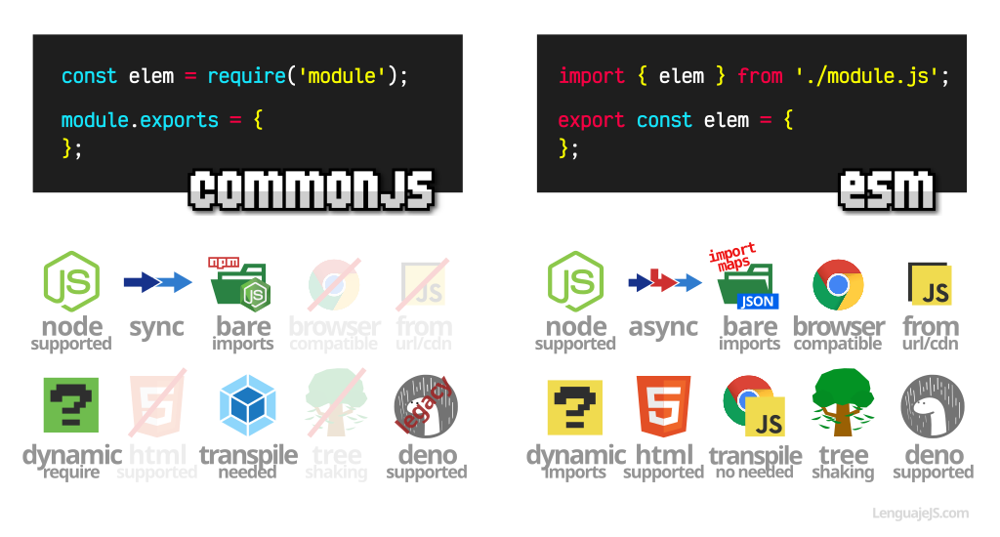

### [< Voltar para o Início](../)

# CommonJS vs ECMAScript Modules (ESM)


<br>
<hr>

## 🟦 CommonJS (CJS)
- **Origem**: CommonJS foi inicialmente criado para o servidor Node.js.
- **Sintaxe de Importação**:
  ```javascript
  const modulo = require('modulo');
  ```
- Sintaxe de Exportação:
  ```javascript
  module.exports = {
    minhaFuncao,
    minhaVariavel
  };

  ```
- Carregamento:
  - **Sincrono:** Os módulos são carregados de forma síncrona, o que pode bloquear o evento loop se o módulo for pesado ou demorar para carregar.
- Contexto:
  - Executa em um escopo local; cada arquivo é um módulo separado.
- Compatibilidade:
  - Compatível apenas com ambientes que suportam o padrão CommonJS, como Node.js.
- Dinamismo:
  - Suporta a importação dinâmica de módulos dentro do código.

<br>

## 🟩 ECMAScript Modules (ESM)
- **Origem**: ECMAScript Modules são uma parte do padrão ES6 (ECMAScript 2015) e foram projetados para substituir o CommonJS.

### IMPORTAÇÂO 
- **Sintaxe de Importação Nomeada**:
  ```javascript
  import { minhaFuncao, minhaVariavel } from './modulo.js';
  ```
- **Importação Padrão (Default):**
  ```javascript
  import minhaFuncaoPadrao from './modulo.js';
  ```
- **Importação com Alias:**
  ```javascript
  import { minhaFuncao as funcao } from './modulo.js';
  ```
- **Importar Tudo (Namespace Import):**
  ```javascript
  import * as modulo from './modulo.js';
  ```

### EXPORTAÇÂO
- **Sintaxe de Exportação Nomeada:**
  ```javascript
    export const minhaFuncao = () => { ... };
    export const minhaVariavel = 42;
  ```
- **Exportação Padrão (Default)**
  ```javascript
    const minhaFuncaoPadrao = () => { ... };
    export default minhaFuncaoPadrao;
  ```  
- **Exportação Multiplas**
  ```javascript
    const funcao1 = () => { ... };
    const funcao2 = () => { ... };
    export { funcao1, funcao2 };
  ```  
- **Exportação com Alias:**
  ```javascript
    const funcaoOriginal = () => { ... };
    export { funcaoOriginal as novaFuncao };
  ```  
- **Exportação Inline Direto:**
  ```javascript
    export function minhaFuncao() { ... }
    export class MinhaClasse { ... }
  ```  

- Carregamento:
  - **Assíncrono:** Os módulos podem ser carregados de forma assíncrona, o que não bloqueia o evento loop.
- Contexto:
  - Executa em um escopo de módulo; cada arquivo é um módulo separado e o escopo não é compartilhado.
- Compatibilidade:
  - Suportado nativamente em navegadores modernos e Node.js.
- Dinamismo:
  - Suporta a importação dinâmica com import(), permitindo a importação condicional e carregamento diferido.

<br>

## 🚀 Diferenças Principais
- **Sintaxe:** CommonJS utiliza require para importação e module.exports para exportação, enquanto ESM utiliza import e export.
- **Carregamento:** CommonJS carrega módulos de forma síncrona; ESM carrega módulos de forma assíncrona.
- **Escopo:** Ambos utilizam escopo de módulo, mas ESM tem suporte nativo e melhor integração com ferramentas modernas.
- **Suporte Nativo:** ESM é suportado nativamente por navegadores modernos e Node.js, enquanto CommonJS é mais comum em ambientes Node.js.