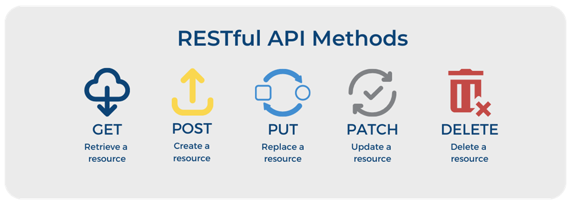

# Principais Tipos de Requisições HTTP



## 🟦 GET
- **Descrição**: Solicita a representação de um recurso específico. As requisições GET devem apenas recuperar dados.
- **Uso Comum**: 
  - Obter dados de uma API ou servidor.
  - Carregar páginas web.
  
- **Exemplo**:
```http
  GET /api/usuarios HTTP/1.1
  Host: exemplo.com
```
- **Características**: 
  - Não altera o estado do recurso no servidor.
  - Pode ser armazenado em cache.
  - Pode ser registrado em histórico do navegador.
  - Pode ser acessado através de um URL.

## 🟩 POST
- **Descrição**: Envia dados ao servidor para criar um novo recurso. Os dados são incluídos no corpo da solicitação.
- **Uso Comum**: 
  - Enviar formulários de dados.
  - Criar novos registros em um banco de dados.
```
    POST /api/usuarios HTTP/1.1
    Host: exemplo.com
    Content-Type: application/json

    {
    "nome": "João",
    "email": "joao@example.com"
    }
```
- **Características**: 
  - Pode alterar o estado do servidor ou recurso.
  - Não é armazenado em cache.
  - Não pode ser registrado em histórico do navegador.
  - Pode incluir grandes quantidades de dados.


## 🟧 PUT
- **Descrição**: Atualiza completamente um recurso existente com os dados fornecidos. Se o recurso não existir, ele pode ser criado.
- **Uso Comum**: 
  - Atualizar informações de um recurso.
  - Substituir um recurso existente.
  
```
    PUT /api/usuarios/123 HTTP/1.1
    Host: exemplo.com
    Content-Type: application/json

    {
    "nome": "João Atualizado",
    "email": "joaoatualizado@example.com"
    }

```
- **Características**: 
  - Idempotente (múltiplas chamadas com a mesma solicitação devem resultar no mesmo estado).


## 🟨 PATCH
- **Descrição**: Aplica modificações parciais a um recurso existente. Difere do PUT, que faz a substituição completa.
- **Uso Comum**: 
  - Atualizar parcialmente informações de um recurso.
  
```
    PATCH /api/usuarios/123 HTTP/1.1
    Host: exemplo.com
    Content-Type: application/json

    {
    "email": "novoemail@example.com"
    }

```
- **Características**: 
  - Não é necessariamente idempotente.


## 🟥 DELETE
- **Descrição**: Remove um recurso específico do servidor.
- **Uso Comum**: 
  - Deletar registros de um banco de dados.
  - Remover arquivos do servidor.
  
```
    DELETE /api/usuarios/123 HTTP/1.1
    Host: exemplo.com

```
- **Características**: 
  - Altera o estado do servidor.
  - Não é armazenado em cache.
  - Não pode ser registrado em histórico do navegador.