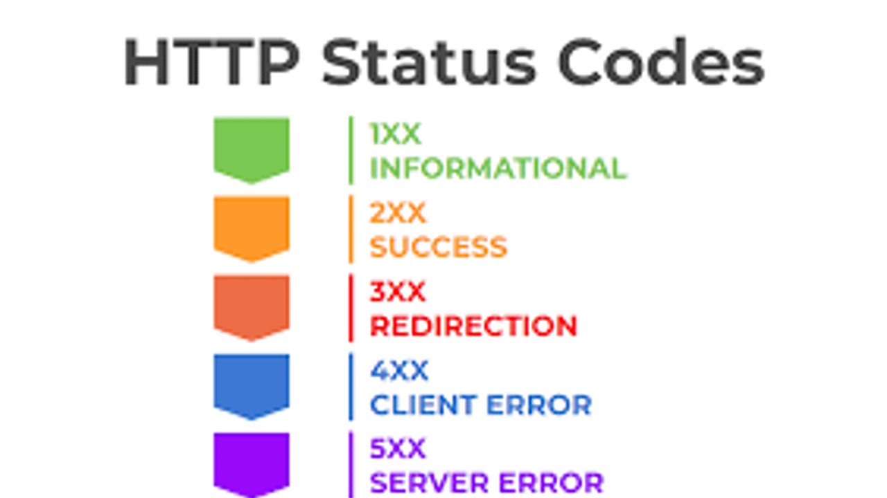

# Principais Status Codes do HTTP

## 🟦 1xx - Informação
- **100 Continue**: O servidor recebeu os cabeçalhos da solicitação e o cliente deve continuar a enviar o corpo da solicitação.
- **101 Switching Protocols**: O cliente requisitou uma mudança de protocolo e o servidor cumpriu a solicitação.
- **102 Processing**: O servidor recebeu a solicitação e está processando-a, mas a resposta ainda não está disponível.

## 🟩 2xx - Sucesso
- **200 OK**: A solicitação foi bem-sucedida.
- **201 Created**: A solicitação foi bem-sucedida e um novo recurso foi criado.
- **202 Accepted**: A solicitação foi aceita para processamento, mas não concluída.
- **204 No Content**: A solicitação foi bem-sucedida, mas não há conteúdo para enviar de volta.
- **205 Reset Content**: O servidor cumpriu a solicitação e pede ao cliente para redefinir a visualização do documento.
- **206 Partial Content**: O servidor está entregando apenas parte do recurso devido a um cabeçalho de intervalo enviado pelo cliente.

## 🟧 3xx - Redirecionamento
- **300 Multiple Choices**: Existem várias opções para o recurso que o cliente pode seguir.
- **301 Moved Permanently**: O recurso solicitado foi movido permanentemente para um novo URI.
- **302 Found**: O recurso solicitado foi encontrado em outro URI temporariamente.
- **303 See Other**: O servidor envia esta resposta para direcionar o cliente a obter o recurso solicitado em outro URI.
- **304 Not Modified**: O recurso não foi modificado desde a última solicitação.
- **307 Temporary Redirect**: O servidor está enviando a resposta com um novo URI, mas o cliente deve usar o mesmo método.
- **308 Permanent Redirect**: Este status é usado para redirecionamentos permanentes onde o cliente deve usar o mesmo método de solicitação.

## 🟥 4xx - Erro do Cliente
- **400 Bad Request**: A solicitação não pôde ser entendida pelo servidor devido a sintaxe inválida.
- **401 Unauthorized**: A solicitação requer autenticação do usuário.
- **403 Forbidden**: O servidor entendeu a solicitação, mas se recusa a autorizá-la.
- **404 Not Found**: O recurso solicitado não foi encontrado no servidor.
- **405 Method Not Allowed**: O método especificado na solicitação não é permitido para o recurso.
- **406 Not Acceptable**: O recurso solicitado só é capaz de gerar conteúdo não aceito de acordo com os cabeçalhos Accept enviados na solicitação.
- **408 Request Timeout**: O servidor esgotou o tempo limite de espera da solicitação do cliente.
- **409 Conflict**: A solicitação não pôde ser concluída devido a um conflito no estado do recurso.
- **410 Gone**: O recurso solicitado não está mais disponível no servidor e nenhuma URL de redirecionamento é conhecida.
- **411 Length Required**: O servidor se recusa a aceitar a solicitação sem um cabeçalho de campo Content-Length válido.
- **413 Payload Too Large**: A solicitação é maior do que o servidor pode ou deseja processar.

## ⬛ 5xx - Erro do Servidor
- **500 Internal Server Error**: O servidor encontrou uma condição inesperada que impediu-o de cumprir a solicitação.
- **501 Not Implemented**: O servidor não reconhece o método de solicitação ou não possui a capacidade de cumprir a solicitação.
- **502 Bad Gateway**: O servidor, atuando como gateway ou proxy, recebeu uma resposta inválida do servidor upstream.
- **503 Service Unavailable**: O servidor está temporariamente indisponível (por exemplo, por sobrecarga ou manutenção).
- **504 Gateway Timeout**: O servidor, atuando como gateway ou proxy, não recebeu uma resposta oportuna do servidor upstream.
- **505 HTTP Version Not Supported**: O servidor não suporta a versão do protocolo HTTP usada na solicitação.
