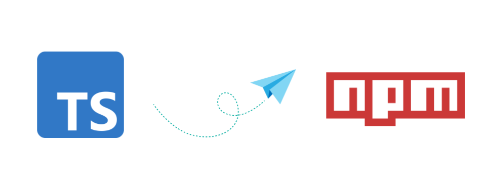

### [< Voltar para o Início](./)

# Comandos Importantes NPM para Node.jse TypeScript



## 🟥 Comandos NPM para Node.js
- Inicializa um Projeto Node.js
  ```bash
  npm init -y
  ```
- Criação de Pastas / Diretórios (src/ é considereada a pasta principal do projeto)
  ```bash
  mkdir [nome da pasta]
  ```
- Criação do Arquivo Inicial para Teste no Console
  ```bash
  echo 'console.log("hello world");' > src/index.ts
  ```
- Exemplo de Scripts Padrões no package.json
  ```json
    "scripts": {
    "dist": "tsup src",
    "start:dev": "tsx src/index.ts",
    "start:watch": "tsx watch src/index.ts",
    "start:dist": "npm run dist && node dist/index.js"
    }
  ```

- Executar Comandos Personalizados dos Scripts
  ```bash
  npm run <nome-do-script>
  ```

## 🟦 Configurações e Comandos do TypeScript
- Inicializa um Projeto Node.js com TypeScript (One Command)
  ```bash
  npm init -y -D typescript
  ```

- Instalação das Dependências TXS
  - O TSX é uma versão melhorada do ts-node que permite executar código TypeScript no Node.js:
  - O tsup é uma ferramenta de empacotamento e compilação para projetos TypeScript que facilita a criação de pacotes JavaScript a partir do código TypeScript.
  
  ```bash
  npm install typescript tsx tsup
  ```

- Cria o arquivo tsconfig
  ```bash
  npx tsc --init
  ```

- Configuração Básica do *tsconfig.json*
  ```json
    {
        "compilerOptions": {
            "target": "ES6",
            "module": "commonjs",
            "rootDir": "./src",
            "outDir": "./dist",
            "strict": true,
            "esModuleInterop": true,
            "skipLibCheck": true
        },
        "include": [
            "src/**/*"
        ],
        "exclude": [
            "node_modules",
            "dist"
        ]
    }
  ```
- Opções Importantes do tsconfig.json
  - **target** : Define a versão do JavaScript que será gerada.
  - **module** : Define o sistema de módulos a ser utilizado CommonJS ou ES6. 
  - **rootDir** : Define o diretório raiz para dos arquivos TypeScript.
  - **outDir** : Define o diretório de saída dos arquivos compilados. BUILD TypeScript To JavaScript
  - **strict** : Ativa todas as verificações de tipo estritas.
  - **esModuleInterop** : Habilita compatibilidade entre módulos CommonJS e ES6.
  - **skipLibCheck** : Pula a verificação de tipo dos arquivos de declaração.
  - **include** : Especifica os arquivos que devem ser incluídos no processo de compilação do TypeScript.
  - **exclude** : Especifica os arquivos e diretórios que devem ser excluídos do processo de compilação.

## 📜 Outros Comandos npm Importantes
- Instalar Pacotes
  ```bash
  npm install <nome-do-pacote>
  ```
- Instalar Pacotes como Dependência de Desenvolvimento
  ```bash
  npm install <nome-do-pacote> --save-dev
  ```
  ou
   ```bash
  npm i <nome-do-pacote> --D
  ```

- Atualizar Todos os Pacotes
  ```bash
  npm update
  ```
- Remover Pacotes
  ```bash
  npm uninstall
  ```
- Listar Pacotes Instalados
  ```bash
  npm list
  ```