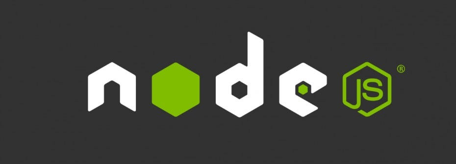

#  RESUMO BackEnd Node.js 

## Conteúdos
1. [Comandos NPM & TypeScript](./Npm.md)
2. [CommonJS vs ECMAScript Modules](./CommonJSvsECM.md)
3. [O Que é uma API](./API.md)
4. [Requisições HTTP](./HTTP-Requisições.md)
5. [Principais Status Codes do HTTP](./HTTP-StatusCode.md)